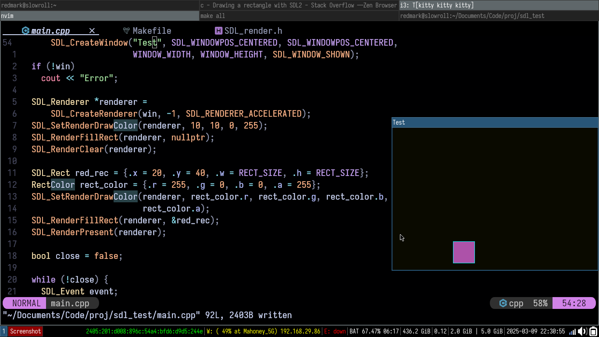

## This is a test to make use the SDL
Currently I can make a floating box go bonkers.



>[!Update]
We have gone beyond Floating box, we are now implementing hard logics in Blocks.
- Implemented Binary Search and got some crazy results. 

### Result 1
``` shell
Clicked at : 32,34
Found block!
It took 22 seconds for linear
Found block at 0, 0 
It took 40 seconds for binary ```

### Result 2
``` shell
Clicked at : 32,34
Found block!
It took 35 seconds for linear
Found block at 0, 0 
It took 5 seconds for binary ```

How to make sense of this result?
